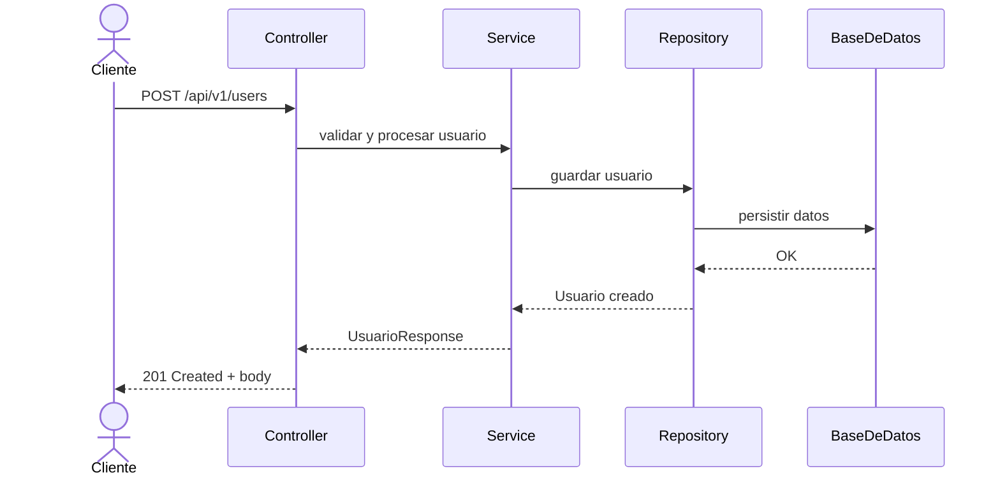

# usuariosAPI

API RESTful desarrollada con Spring Boot para la gestión de usuarios, incluyendo generacion de JWT por usuario.

## Descripción Funcional

Este servicio expone una API que permite:

- Crear nuevos usuarios con validación.
- Consultar y listar usuarios.
- Actualizar y parchar usuarios.
- Eliminar usuarios (eliminacion logica)

Incluye validaciones de campos, hashing de contraseñas y control de acceso vía JWT.

## Arquitectura

- Desarrollado con IntelliJ 2025.1.3
- Spring Boot 2.7.18 con Java 11
- Maven
- Spring Data JPA para acceso a base de datos 
- BD H2 en memoria, compatible con Hibernate
- Lombok para reducir boilerplate
- Logger con Logback
- Swagger con springdoc-openapi-ui
- Tests con JUnit y SpringBootTest
- Arquitectura en capas: Controller -> Service -> Repository -> DB
- Modelos de clases y Objetos: DTOs (API Requests y Responses). Entidades (de Persistencia)



## Ejecución

- Ejecutar con Maven ./mvnw spring-boot:run
- Swagger disponible en http://localhost:8080/api/swagger-ui/index.html
- Consola de BD H2: http://localhost:8080/api/h2-console

## Tests
./mvnw test

Hay dos tests, para probar los metodos publicos de la clase UserService
- UserServiceIntegrationTest
- UserServiceEdgeCaseTest

Se incluye Postman collection para probar los endpoints.

## Seguridad 

- Se implementa JWT Token estandar, firmado con algoritmo HS256, con payload que incluye email de usuario. 
- Password se almacena de forma segura hasheada, con ayuda de una SALT aleatoria, con BCryptPasswordEncoder.

# Estructura de Carpetas

```bash
- api -> Implementacion de capa REST 
  - controller (RestControllers)
  - dto (Request y Response de la API)
- config -> Configuraciones generales
- domain -> Clases con lógica de negocio
- entities -> Entidades de BD (Con Anotaciones JPA)
- exceptions -> Custom Exceptions
- repository -> Definicion de Repository para acceso a BD
- security -> Implementacion de componentes de seguridad (JWT, Hash de password)
- service -> Implementacion de logica de negocio (capa service)
- UsuariosApiApplication.java -> clase inicial de sprintboot
- resources/application.properties -> configuraciones
```

## BD 

- Los datos se pierden al reiniciar (uso de H2 en memoria).
- Para persistencia real, configurar datasource en application.properties